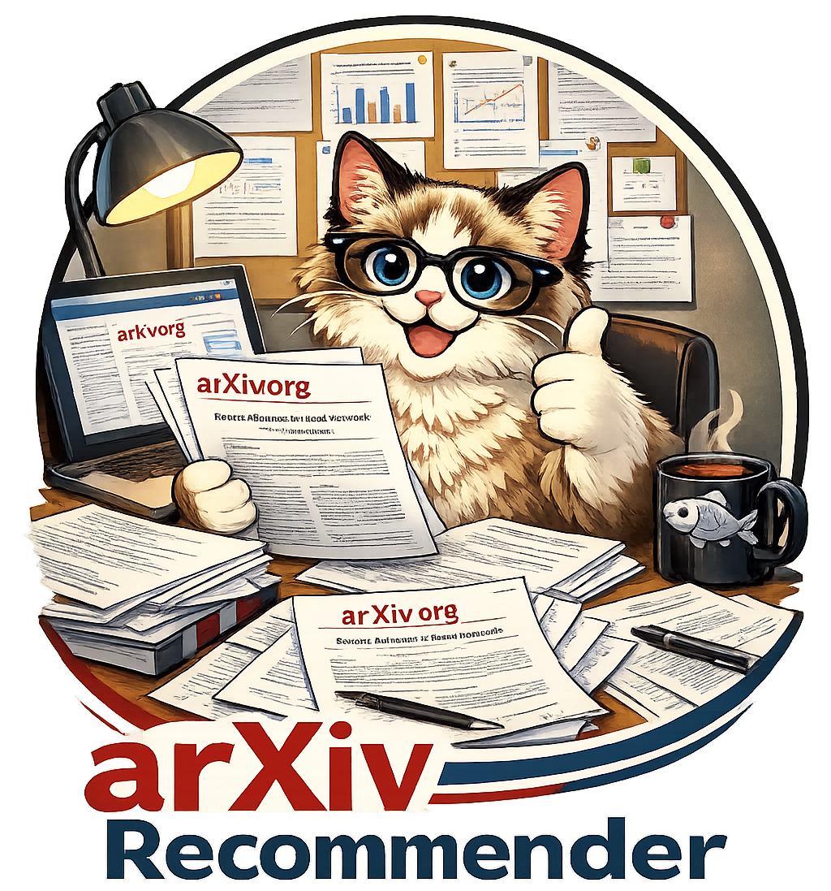

# 📚 ArXiv Recommender

<p align="center">
  
</p>

<p align="center">
  <b>Automated research discovery using Bi-Encoder filtering and LLM-as-a-Judge ranking.</b>
</p>

<p align="center">
  
  
  
  
  
</p>

---

## 🚀 Overview

`arxiv_recommender` is a lightweight, local-first tool for staying ahead of the ArXiv curve. It implements a **two-stage paper ranking pipeline**:

1. **Fetch:** Retrieve the latest daily papers from ArXiv via API.
2. **Coarse Filtering:** High-speed semantic search using `sentence-transformers` (Bi-Encoders) to prune hundreds of papers based on your embedding profile.
3. **Fine Ranking:** LLM-as-a-Judge (local via Ollama) to rank the top candidates with qualitative reasoning.

## ⚡ Quick Start — GitHub Actions (recommended)

- Fork this repository on GitHub. The included GitHub Actions workflow (defined in `.github/workflows/daily.yaml`) will run the recommender on a schedule for you. By default, the workflow is scheduled to run at 16:00 UTC (8:00 AM PST); GitHub Actions uses UTC, so local Pacific time may shift with Daylight Saving Time.
- Add the following GitHub Secrets to your fork (Settings → Secrets → Actions) to enable email notifications:
  - `EMAIL_USERNAME` — SMTP username for the sender email.
  - `EMAIL_PASSWORD` — SMTP password or app-specific password.
  - `NOTIFY_RECIPIENT` — recipient email address for recommendations.
- Your research interests, ranking hyperparameters, local model selection, and other settings can be configured in `src/config.yaml`.

## 📦 Local Installation (Optional)

Ensure you have [uv](https://docs.astral.sh/uv/) and [Ollama](https://ollama.com/) installed.

If you prefer to run locally for development or testing, follow these steps:

```bash
# Clone your fork and enter the repository
git clone https://github.com/<your-username>/arxiv_recommender.git
cd arxiv_recommender

# Sync dependencies with uv
uv sync

# Pull the recommended local model (if using Ollama locally)
ollama pull llama3.2:3b

# Run the pipeline locally
uv run arxiv-rec
```
