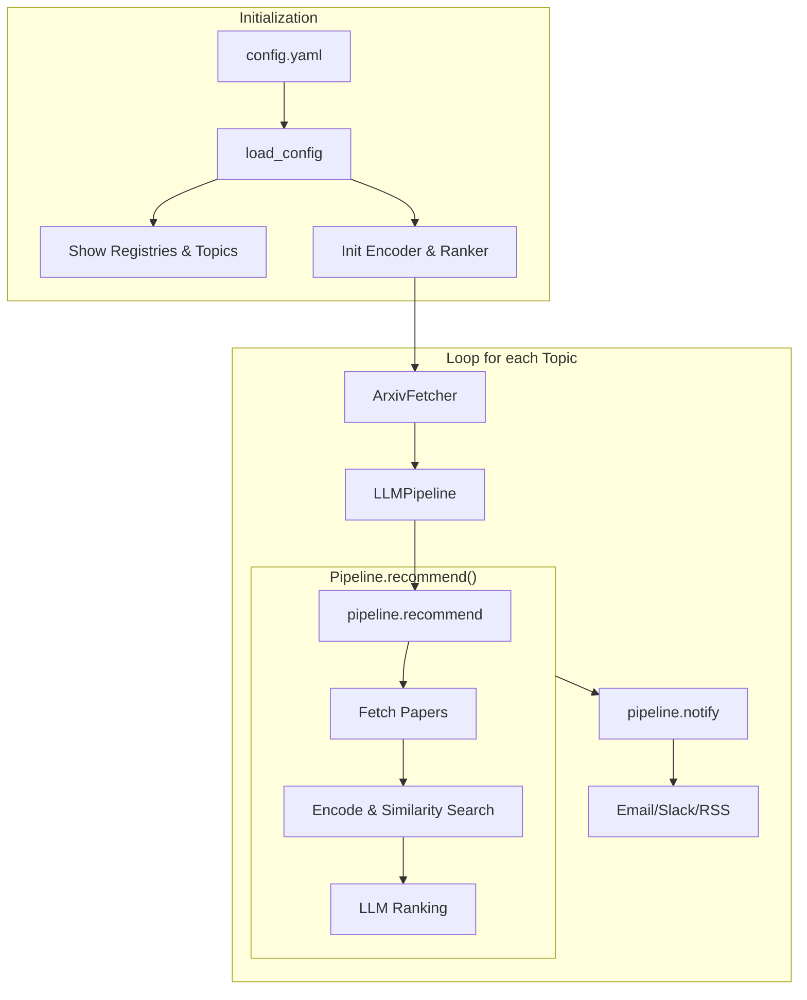

# ArXiv Recommender 🚀

**ArXiv Recommender** is a modular, AI-powered pipeline designed to help researchers keep up with the daily influx of new papers. It fetches daily papers, ranks them using LLMs, and notifies you via your preferred channel.

## Key Features
* **Modular Architecture**: Swap LLMs (OpenAI, Ollama, Gemini) and Notifiers (Email, Slack) via a registry system.
* **Vector-Based Ranking**: Uses state-of-the-art encoders to find papers that match your research interests.
* **CLI-First**: Designed for automation via GitHub Actions or local CRON jobs.

## System Architecture

